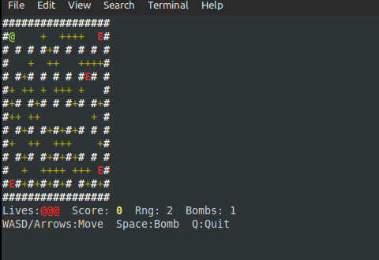

# Blasterman

ASCII Blasterman game for Linux terminals, written in Ada.




## Requirements

- GNAT (GCC Ada)
- GNU Make
- A Linux terminal with ANSI colour support

No external libraries required. Only ANSI escape codes and a thin C `termios` binding are used.

## Build & Run

```sh
make        # compile
make run    # compile and launch
make clean  # remove build artefacts
```

The binary is placed at `./blasterman`.

## Controls

| Key | Action |
|-----|--------|
| `W` / `↑` | Move up |
| `S` / `↓` | Move down |
| `A` / `←` | Move left |
| `D` / `→` | Move right |
| `Space` | Place bomb |
| `R` | Restart (after win or game over) |
| `Q` | Quit |

## Gameplay

- Eliminate all **4 enemies** (`E`) to win.
- Place bombs (`O`) - they explode after ~3 seconds in a cross-shaped blast.
- Flames (`*`) kill enemies (+100 pts each) and the player.
- The player has **3 lives**. A brief invincibility period follows each hit.
- Destroy soft blocks (`+`) to uncover power-ups:
  - `R` - increases bomb blast range
  - `B` - increases maximum bombs you can have active at once
- Collecting a power-up awards **50 points**.
- Bombs can chain-detonate each other.

## Map Legend

| Symbol | Meaning |
|--------|---------|
| `#` | Indestructible wall / border |
| `+` | Destructible soft block |
| ` ` | Empty floor |
| `@` | Player |
| `E` | Enemy |
| `O` | Live bomb |
| `*` | Explosion flame |
| `R` | Range power-up |
| `B` | Extra bomb power-up |

## Source Layout

```
Makefile
src/
  terminal_c.c       C shim — termios raw mode, non-blocking select I/O
  terminal.ads/adb   ANSI escape helpers, arrow-key sequence decoding
  game_types.ads     Shared types and map-dimension constants
  map.ads/adb        17×14 tile grid and procedural level generation
  game.ads/adb       Player, bombs, explosions, enemy AI, power-ups
  renderer.ads/adb   Priority-layered ASCII renderer and HUD
  main.adb           Game loop, restart logic, terminal lifecycle
```

## Technical Notes

- **Fixed timestep** of ~15 fps (`delay 0.067` in main loop).
- The map uses the classic layout: indestructible pillar checkerboard at every (odd row, odd column) inside the border, with random soft blocks filling ~50 % of the remaining interior. A safe corridor is always cleared around each spawn point.
- Enemy AI wanders randomly when far from the player and switches to cardinal-direction chase when within Manhattan distance 6.
